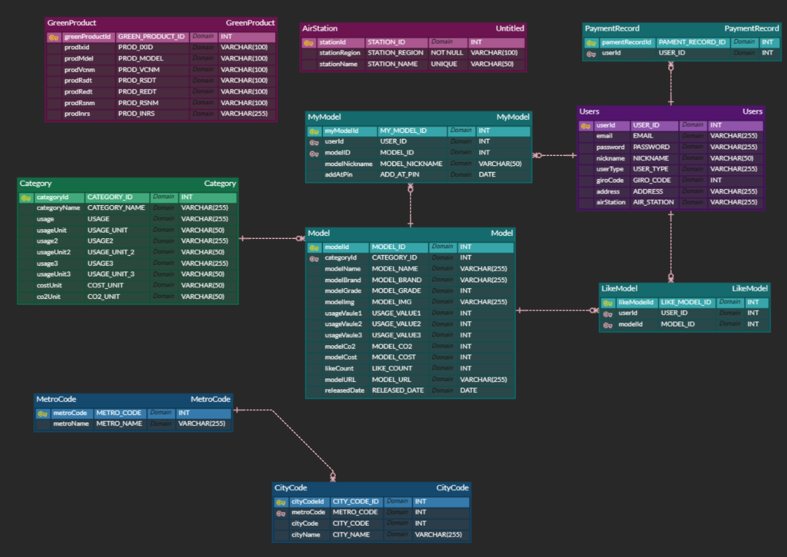

# Knocknock

## 👩‍💻👨‍💻 팀원 소개

팀원 : 김경희, 문홍웅, 배찬일, 이주희, 조윤영, 조은비

<br>
<br>

## 📅 프로젝트 기간

### 2023.10.10 ~ 2023.11.17 (7주)

- 기획 및 설계 : 2023.10.10 ~ 2023.10.20
- 프로젝트 구현 : 2023.10.23 ~ 2023.11.10
- 버그 수정 및 산출물 정리 : 2023.11.11 ~ 2023.11.17

<br>

<br>

## 💡 프로젝트 컨셉 및 주요 기능

### Knocknock

<br>

### 의도

이 프로젝트는 사용자들이 에너지 효율이 높은 가전 제품을 선택할 수 있도록 도와, 환경 보호에 기여하고자 합니다. 목표는 환경 친화적인 소비를 장려하고, 에너지 소비를 줄이는 것입니다. 사용자는 이 어플리케이션을 통해 각 가전 제품의 에너지 효율을 비교하고, 자신의 생활 스타일에 가장 적합한 제품을 선택할 수 있습니다.

<br>

### 예상 사용자

이 어플리케이션의 주요 사용자는 환경을 고려하여 의식 있는 소비를 하고자 하는 소비자들입니다. 특히, 새 가전 제품을 구매하려는 가정주부, 에코 프렌들리 제품에 관심이 많은 젊은 세대, 그리고 에너지 비용을 절감하고자 하는 가정들이 주 대상이 될 것입니다.

<br>

### 주요 기능

새 가전제품 검색: 새로 구매 희망하는 가전제품을 카테고리 별로 검색하고 찜을 할 수 있습니다.
에너지 효율 비교: 다양한 가전 제품의 에너지 효율 라벨을 비교하여 사용자가 가장 효율적인 제품을 선택할 수 있게 합니다.

제품 자동 등록: NAVER CLOVA OCR 기술을 활용하여 제품의 에너지 효율 라벨을 인식하고 사용자의 가전 제품 목록에 자동으로 등록합니다. 인식이 안 될 경우 수기로 등록 가능합니다.

다크모드/일반 모드: 사용자의 선호에 따라 인터페이스 모드를 변경할 수 있는 기능을 제공합니다.

주소기반 대기질 확인: 사용자의 주소 기반 현재 대기질 상태를 시각적인 UI를 통해 확인할 수 있습니다.

녹색제품 정보 확인: 해당 제품이 녹색제품에 등록되어 있는지 확인할 수 있습니다.

폐가전 수거 업체 확인: 사용자의 주소 기반 가장 가까운 폐가전 수거 업체를 확인할 수 있습니다.

가구평균 전력사용량 확인: 사용자의 주소 기반 가구 평균 전력 사용량을 확인할 수 있습니다.

<br>

### 기대 효과

환경 보호 증진: 에너지 효율이 높은 제품을 선택함으로써 전반적인 에너지 소비 감소에 기여하고, 환경 보호에 긍정적인 영향을 미칠 것으로 기대됩니다.
의식 있는 소비 유도: 사용자들이 제품을 선택할 때 환경적 측면을 고려하도록 유도하여, 책임 있는 소비 문화를 장려합니다.
에너지 비용 절감: 에너지 효율이 높은 제품을 사용함으로써 장기적으로 가정의 에너지 비용을 절감할 수 있습니다.
사용자 편의성 증대: 제품의 에너지 효율 정보를 쉽게 비교하고, 제품을 편리하게 관리할 수 있어 사용자 경험이 개선됩니다.

<br>
<br>

## 🛠️ 기술스택

### front

  

### back

     

### DB

  

### CI/CD

   

### 외부 API

    

### 협업툴

    

<br>
<br>

## 🗃️ ERD



<br>

<br>

## 🎨 Figma


<br>

<br>

## 🗳️ API 명세서

[API 명세서 보러가기 (∩^o^)⊃━☆](https://low-lycra-241.notion.site/REST-API-5b893dd01a8d4c888251539d728c4c67?pvs=4)

<br>
<br>

## 📂 프로젝트 구성

시스템 아키텍처

<br>

- FE 폴더 구조

  ```

  ```

- BE 폴더 구조

```
📁back
├─ 📄.gitignore
├─ 📄.gitkeep
├─ 📁gradle
│  └─ 📁wrapper
│     ├─ 📄gradle-wrapper.jar
│     └─ 📄gradle-wrapper.properties
├─ 📄gradlew
├─ 📄gradlew.bat
├─ 📄README.md
└─ 📁src
   ├─ 📁main
   │  ├─ 📁java
   │  │  └─ 📁com
   │  │     └─ 📁knocknock
   │  │        ├─ 📁domain
   │  │        │  ├─ 📁category
   │  │        │  │  ├─ 📁api
   │  │        │  │  │  └─ 📄CategoryController.java
   │  │        │  │  ├─ 📁dao
   │  │        │  │  │  └─ 📄CategoryRepository.java
   │  │        │  │  ├─ 📁domain
   │  │        │  │  │  ├─ 📄Category.java
   │  │        │  │  │  └─ 📄CategorySummary.java
   │  │        │  │  ├─ 📁dto
   │  │        │  │  │  └─ 📁response
   │  │        │  │  │     └─ 📄FindCategoryListResDto.java
   │  │        │  │  └─ 📁service
   │  │        │  │     ├─ 📄CategoryService.java
   │  │        │  │     └─ 📄CategoryServiceImpl.java
   │  │        │  ├─ 📁email
   │  │        │  │  ├─ 📁api
   │  │        │  │  │  └─ 📄EmailController.java
   │  │        │  │  ├─ 📁domain
   │  │        │  │  │  └─ 📄EmailMessage.java
   │  │        │  │  ├─ 📁dto
   │  │        │  │  │  ├─ 📄EmailCodeReqDto.java
   │  │        │  │  │  ├─ 📄EmailCodeResDto.java
   │  │        │  │  │  └─ 📄EmailPostDto.java
   │  │        │  │  ├─ 📁exception
   │  │        │  │  │  ├─ 📄EmailCodeException.java
   │  │        │  │  │  ├─ 📄EmailCodeNotFoundException.java
   │  │        │  │  │  ├─ 📄EmailException.java
   │  │        │  │  │  └─ 📄EmailExceptionMessage.java
   │  │        │  │  └─ 📁service
   │  │        │  │     ├─ 📄EmailService.java
   │  │        │  │     └─ 📄EmailServiceImpl.java
   │  │        │  ├─ 📁greenProduct
   │  │        │  │  ├─ 📁api
   │  │        │  │  │  └─ 📄GreenProductController.java
   │  │        │  │  ├─ 📁dao
   │  │        │  │  │  └─ 📄GreenProductRepository.java
   │  │        │  │  ├─ 📁domain
   │  │        │  │  │  └─ 📄GreenProduct.java
   │  │        │  │  ├─ 📁dto
   │  │        │  │  │  └─ 📁response
   │  │        │  │  │     ├─ 📄GreenProductDataResDto.java
   │  │        │  │  │     └─ 📄GreenProductResDto.java
   │  │        │  │  ├─ 📁exception
   │  │        │  │  │  ├─ 📄GreenProductExceptionMessage.java
   │  │        │  │  │  └─ 📄GreenProductNotFoundException.java
   │  │        │  │  └─ 📁service
   │  │        │  │     ├─ 📄GreenProductService.java
   │  │        │  │     └─ 📄GreenProductServiceImpl.java
   │  │        │  ├─ 📁model
   │  │        │  │  ├─ 📁api
   │  │        │  │  │  └─ 📄ModelController.java
   │  │        │  │  ├─ 📁constant
   │  │        │  │  │  ├─ 📄AwsS3ImgLink.java
   │  │        │  │  │  └─ 📄SearchType.java
   │  │        │  │  ├─ 📁dao
   │  │        │  │  │  ├─ 📄LikeModelRepository.java
   │  │        │  │  │  ├─ 📄LikeModelRepositoryCustom.java
   │  │        │  │  │  ├─ 📄LikeModelRepositoryCustomImpl.java
   │  │        │  │  │  ├─ 📄ModelRepository.java
   │  │        │  │  │  ├─ 📄ModelRepositoryCustom.java
   │  │        │  │  │  ├─ 📄ModelRepositoryCustomImpl.java
   │  │        │  │  │  ├─ 📄MyModelRepository.java
   │  │        │  │  │  ├─ 📄MyModelRepositoryCustom.java
   │  │        │  │  │  └─ 📄MyModelRepositoryCustomImpl.java
   │  │        │  │  ├─ 📁domain
   │  │        │  │  │  ├─ 📄LikeModel.java
   │  │        │  │  │  ├─ 📄Model.java
   │  │        │  │  │  └─ 📄MyModel.java
   │  │        │  │  ├─ 📁dto
   │  │        │  │  │  ├─ 📁request
   │  │        │  │  │  │  ├─ 📄AddModelReqDto.java
   │  │        │  │  │  │  ├─ 📄AddMyModelReqDto.java
   │  │        │  │  │  │  └─ 📄CheckModelByLabelImgReqDto.java
   │  │        │  │  │  └─ 📁response
   │  │        │  │  │     ├─ 📄CheckModelResDto.java
   │  │        │  │  │     ├─ 📄CompareModelAndMyModelResDto.java
   │  │        │  │  │     ├─ 📄FindLikeModelListResDto.java
   │  │        │  │  │     ├─ 📄FindModelListResDto.java
   │  │        │  │  │     ├─ 📄FindModelResDto.java
   │  │        │  │  │     ├─ 📄FindMyModelListResDto.java
   │  │        │  │  │     └─ 📄FindMyModelResDto.java
   │  │        │  │  ├─ 📁exception
   │  │        │  │  │  └─ 📄ModelNotFoundException.java
   │  │        │  │  └─ 📁service
   │  │        │  │     ├─ 📄LikeModelService.java
   │  │        │  │     ├─ 📄LikeModelServiceImpl.java
   │  │        │  │     ├─ 📄ModelService.java
   │  │        │  │     ├─ 📄ModelServiceImpl.java
   │  │        │  │     ├─ 📄MyModelService.java
   │  │        │  │     └─ 📄MyModelServiceImpl.java
   │  │        │  ├─ 📁user
   │  │        │  │  ├─ 📁api
   │  │        │  │  │  ├─ 📄UserController.java
   │  │        │  │  │  └─ 📄UserSocialController.java
   │  │        │  │  ├─ 📁constants
   │  │        │  │  │  └─ 📄MetroName.java
   │  │        │  │  ├─ 📁dao
   │  │        │  │  │  ├─ 📄CityCodeRepository.java
   │  │        │  │  │  ├─ 📄LogoutAccessTokenRedisRepository.java
   │  │        │  │  │  ├─ 📄MetroCodeRepository.java
   │  │        │  │  │  ├─ 📄RefreshTokenRedisRepository.java
   │  │        │  │  │  ├─ 📄UserQueryDslRepository.java
   │  │        │  │  │  └─ 📄UserRepository.java
   │  │        │  │  ├─ 📁domain
   │  │        │  │  │  ├─ 📄CityCode.java
   │  │        │  │  │  ├─ 📄LogoutAccessToken.java
   │  │        │  │  │  ├─ 📄MetroCode.java
   │  │        │  │  │  ├─ 📄RefreshToken.java
   │  │        │  │  │  ├─ 📄Users.java
   │  │        │  │  │  └─ 📄UserType.java
   │  │        │  │  ├─ 📁dto
   │  │        │  │  │  ├─ 📁password
   │  │        │  │  │  │  ├─ 📄FindPasswordReqDto.java
   │  │        │  │  │  │  ├─ 📄PasswordReqDto.java
   │  │        │  │  │  │  └─ 📄UpdatePasswordReqDto.java
   │  │        │  │  │  ├─ 📁request
   │  │        │  │  │  │  ├─ 📄CheckGoogleReqDto.java
   │  │        │  │  │  │  ├─ 📄GiroCodeReqDto.java
   │  │        │  │  │  │  ├─ 📄GoogleLoginReqDto.java
   │  │        │  │  │  │  ├─ 📄LoginReqDto.java
   │  │        │  │  │  │  ├─ 📄UpdateAddressReqDto.java
   │  │        │  │  │  │  ├─ 📄UpdateUserReqDto.java
   │  │        │  │  │  │  ├─ 📄UserReqDto.java
   │  │        │  │  │  │  └─ 📄UserSearchCondition.java
   │  │        │  │  │  └─ 📁response
   │  │        │  │  │     ├─ 📄AdminUserResDto.java
   │  │        │  │  │     ├─ 📄FindPowerUsageHouseAvgResDto.java
   │  │        │  │  │     ├─ 📄LoginResDto.java
   │  │        │  │  │     ├─ 📄ReissueTokenResDto.java
   │  │        │  │  │     ├─ 📄SocialLoginResDto.java
   │  │        │  │  │     ├─ 📄UpdateAddressResDto.java
   │  │        │  │  │     └─ 📄UserResDto.java
   │  │        │  │  ├─ 📁exception
   │  │        │  │  │  ├─ 📄UserException.java
   │  │        │  │  │  ├─ 📄UserExceptionMessage.java
   │  │        │  │  │  ├─ 📄UserNotFoundException.java
   │  │        │  │  │  └─ 📄UserUnAuthorizedException.java
   │  │        │  │  └─ 📁service
   │  │        │  │     ├─ 📄UserService.java
   │  │        │  │     ├─ 📄serServiceImpl.java
   │  │        │  │     ├─ 📄UserSocialService.java
   │  │        │  │     └─ 📄UserSocialServiceImpl.java
   │  │        │  └─ 📁waste
   │  │        │     ├─ 📁api
   │  │        │     │  └─ 📄WasteController.java
   │  │        │     ├─ 📁dao
   │  │        │     │  └─ 📄WasteRepository.java
   │  │        │     ├─ 📁domain
   │  │        │     │  └─ 📄Waste.java
   │  │        │     ├─ 📁dto
   │  │        │     │  ├─ 📄WasteReqDto.java
   │  │        │     │  ├─ 📄WasteResDataDto.java
   │  │        │     │  └─ 📄WasteResDto.java
   │  │        │     └─ 📁service
   │  │        │        ├─ 📄WasteService.java
   │  │        │        └─ 📄WasteServiceImpl.java
   │  │        ├─ 📁global
   │  │        │  ├─ 📁common
   │  │        │  │  ├─ 📁external
   │  │        │  │  │  ├─ 📁constants
   │  │        │  │  │  │  └─ 📄ExternalApiBaseUrl.java
   │  │        │  │  │  ├─ 📁kepco
   │  │        │  │  │  │  └─ 📄KepcoAPIWebClient.java
   │  │        │  │  │  └─ 📁ocr
   │  │        │  │  │     ├─ 📁dto
   │  │        │  │  │     │  ├─ 📄ImageInfoDto.java
   │  │        │  │  │     │  └─ 📄ImageRequestDto.java
   │  │        │  │  │     └─ 📄OCRAPIWebClient.java
   │  │        │  │  ├─ 📁jwt
   │  │        │  │  │  ├─ 📄JwtExpirationEnum.java
   │  │        │  │  │  └─ 📄JwtHeaderUtilEnum.java
   │  │        │  │  ├─ 📁openapi
   │  │        │  │  │  ├─ 📁airInfo
   │  │        │  │  │  │  ├─ 📄AirInfoController.java
   │  │        │  │  │  │  ├─ 📄AirInfoService.java
   │  │        │  │  │  │  ├─ 📁dto
   │  │        │  │  │  │  │  ├─ 📄AirInfoResDto.java
   │  │        │  │  │  │  │  ├─ 📄AirStationDto.java
   │  │        │  │  │  │  │  └─ 📄TmPointDto.java
   │  │        │  │  │  │  └─ 📄StationType.java
   │  │        │  │  │  ├─ 📁constants
   │  │        │  │  │  │  ├─ 📄CategoryURL.java
   │  │        │  │  │  │  ├─ 📄CategoryUsageType.java
   │  │        │  │  │  │  └─ 📄StationNameType.java
   │  │        │  │  │  └─ 📁energy
   │  │        │  │  │     └─ 📄OpenAPIWebClient.java
   │  │        │  │  ├─ 📁security
   │  │        │  │  │  ├─ 📄AccessDeniedHandlerIml.java
   │  │        │  │  │  ├─ 📄AuthenticationEntryPointImpl.java
   │  │        │  │  │  ├─ 📄AuthenticationJwtFilter.java
   │  │        │  │  │  ├─ 📄UserDetailsImpl.java
   │  │        │  │  │  └─ 📄UserDetailsServiceImpl.java
   │  │        │  │  └─ 📁service
   │  │        │  │     └─ 📄RedisService.java
   │  │        │  ├─ 📁config
   │  │        │  │  ├─ 📄OAuth2Config.java
   │  │        │  │  ├─ 📄QuerydslConfig.java
   │  │        │  │  ├─ 📄RedisConfig.java
   │  │        │  │  ├─ 📄SecurityConfig.java
   │  │        │  │  └─ 📄SwaggerConfig.java
   │  │        │  ├─ 📁dto
   │  │        │  │  └─ 📄MessageDto.java
   │  │        │  ├─ 📁exception
   │  │        │  │  ├─ 📁exception
   │  │        │  │  │  ├─ 📄AuthenticationException.java
   │  │        │  │  │  ├─ 📄BadRequestException.java
   │  │        │  │  │  ├─ 📄NotFoundException.java
   │  │        │  │  │  └─ 📄TokenException.java
   │  │        │  │  ├─ 📄RestControllerExceptionHandler.java
   │  │        │  │  └─ 📄SecurityExceptionMessage.java
   │  │        │  └─ 📁util
   │  │        │     ├─ 📄CrawlingUtil.java
   │  │        │     └─ 📄JwtUtil.java
   │  │        └─ 📄KnocknockApplication.java
   │  └─ 📁resources
   │     ├─ 📄application-back-develop.yml
   │     ├─ 📄application-develop.yml
   │     ├─ 📄application-yy.yml
   │     ├─ 📄application.yml
   │     ├─ 📄data.sql
   │     ├─ 📁static
   │     │  └─ 📄index.html
   │     └─ 📁templates
   │        ├─ 📄email.html
   │        └─ 📄password.html
   └─ 📁test
      └─ 📁java
         └─ 📁com
            └─ 📁knocknock
               └─ 📁knocknock
                  └─ 📄KnocknockApplicationTests.java

```

<br>
<br>

## 🖥 서비스 화면
### 1. 서비스를 처음 시작하는 화면


1. 시작하기: 로그인 화면으로 이동합니다.

### 2. 로그인 화면 


1. 로그인: 로그인 성공 시 서비스를 이용할 수 있습니다.

2. 구글 로그인: 로그인 성공 시 서비스를 이용할 수 있습니다.

3. 회원가입: 회원가입 화면으로 이동합니다.

4. 비밀번호 재발급: 비밀번호 재발급 모달을 생성합니다.

### 3. 회원가입 화면


1. 이메일 인증: 이메일 발송 후 인증번호를 확인합니다.

2. 도로명 검색: 도로명 검색창을 생성합니다.

3. 회원가입: 회원가입 성공 시 로그인 화면으로 이동합니다.

### 4. 비밀번호 재발급 모달


1. 비밀번호 재발급: 닉네임, 이메일 일치 시 해당 이메일로 비밀번호를 재발급 합니다.

### 5. 새 가전 찾기 화면(라이트 모드, 다크 모드)


1. 카테고리 선택 시 해당 가전 리스트 화면으로 이동합니다.

### 5. 가전 리스트(라이트 모드, 다크 모드)


1. 검색: 모델명, 업체명으로 가전을 검색할 수 있습니다.

2. 가전 선택 시 상세보기 화면으로 이동합니다.

3. 가전을 찜할 수 있습니다. 

### 6. 가전 상세조회 화면(라이트 모드, 다크 모드)


1. 비교할 가전 선택 화면으로 이동합니다.

2. 쿠팡 구매 링크로 이동합니다.

3. 가전을 찜할 수 있습니다.

### 7. 비교할 가전 선택 화면(라이트 모드, 다크 모드)


1. 가전 비교 화면으로 이동합니다.

### 8. 비교하기 화면(라이트 모드, 다크 모드)


1. 가전을 터치하면 해당 가전의 그래프가 커집니다.

2. 교체하면 어떤 것이 좋은지 보여주는 모달을 생성합니다.

### 9. 교체 시 이점 모달(라이트 모드, 다크 모드)


1. 환경오염정도를 비교하여 나오는 모달을 다르게 생성합니다.

### 10. 서비스 페이지(라이트 모드, 다크 모드)


1. 가전 서비스: 가전 서비스 화면으로 이동합니다.

2. 우리 동네 전력 소비: 우리 동네 평균 전력 소비량을 확인할 수 있습니다.

3. 폐가전 수거 정보: 근처에 있는 폐가전 수거 업체를 추천해줍니다.

4. 내 정보 수정: 내 정보를 수정할 수 있는 화면으로 이동합니다.

5. 로그아웃: 로그아웃할 수 있습니다.

### 11. 우리 동네 전력 소비 화면


1. 그래프를 클릭하면 자세한 수치를 볼 수 있습니다.

### 12. 폐가전 수거 정보 화면


1. GoogleMap을 통해 위치를 업체의 위치를 확인할 수 있습니다. 

### 13. 정보 수정 화면


1. 정보 수정 전 비밀번호 확인 모달을 생성합니다.


3.
## 📌 시연 시나리오

<br>
<br>

## 🎥 UCC

<br>
<br>

## 📊 PPT 발표 자료
